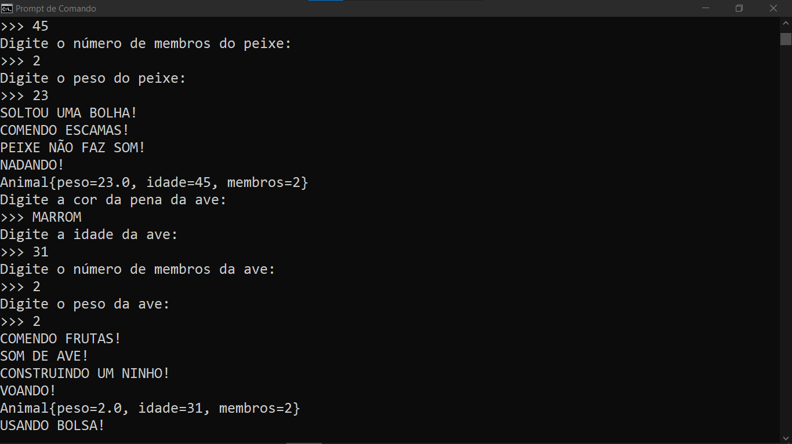

# PROJETO ZOOLOGICO
👨‍🏫PROJETO CRIADO PARA O CURSO DE JAVA DO CURSO EM VIDEO.

 <br>

## DESCRIÇÃO:
Este projeto é uma simulação de diferentes classes de animais (mamíferos, répteis, peixes, aves, etc.) em Java, utilizando o conceito de **orientação a objetos**. Ele inclui a criação de instâncias de classes específicas, que representam esses animais, e permite que o usuário forneça valores de entrada para seus atributos, como cor, peso, idade e outros. O projeto também demonstra polimorfismo e herança entre as classes de animais, com ações específicas que cada animal pode realizar (alimentar-se, locomover-se, emitir som, etc.).

## COMPONENTES PRINCIPAIS:
- **Classes**: O projeto inclui várias classes que representam diferentes tipos de animais:
  - `Mamifero`, `Reptil`, `Peixe`, `Ave`, `Cachorro`, `Canguru`, `Cobra`, `Tartaruga`, `Goldfish`, `Arara`.
- **Herança**: As classes seguem uma hierarquia, com algumas classes mais específicas (como `Cachorro` e `Canguru`) herdando comportamentos de classes mais gerais (`Mamifero`).
- **Polimorfismo**: Cada classe de animal pode ter comportamentos personalizados que são invocados no método `main`. Por exemplo, o método `locomover()` pode ter uma implementação diferente para `Ave` (voar) e `Peixe` (nadar).
- **Interatividade**: Com o uso da classe `Scanner`, o projeto permite que o usuário insira dados diretamente no terminal para configurar atributos como a cor, o peso e a idade dos animais.

## EXECUTANDO O PROJETO:
1. **Certifique-se de que o projeto esteja compilado:**
   Antes de executar o projeto, você deve garantir que ele foi compilado corretamente. Navegue até o diretório `./CODIGO`, e use o seguinte comando para compilar:

   ```bash
   mvn clean install
   ```

2. **Executar o projeto:**
   Para executar a aplicação Swing com o Maven, usando a classe principal definida no seu `pom.xml`, use o comando:

   ```bash
   mvn exec:java
   ```

3. **Interaja com o programa**: Ao rodar o programa, ele solicitará que você insira informações sobre os animais. Por exemplo:

   ```
   Digite a cor do pelo do mamífero: 
   >>>MARROM
   Digite o peso do mamífero: 35.6
   Digite a cor da escama do réptil: 
   >>>VERDE
   Digite a idade do réptil: 
   >>>5
   Digite o número de membros do réptil: 
   >>>4
   Digite o peso do réptil: 
   >>>10.5
   ...
   ```

   O usuário insere esses valores, e o programa os utiliza para configurar os objetos e invocar seus comportamentos, como locomover-se, alimentar-se, etc.

## CREDITOS:
- [PROJETO CRIADO PARA O CURSO DE JAVA](https://github.com/VILHALVA/CURSO-DE-JAVA)
- [PROJETO FEITO PELO VILHALVA](https://github.com/VILHALVA)


